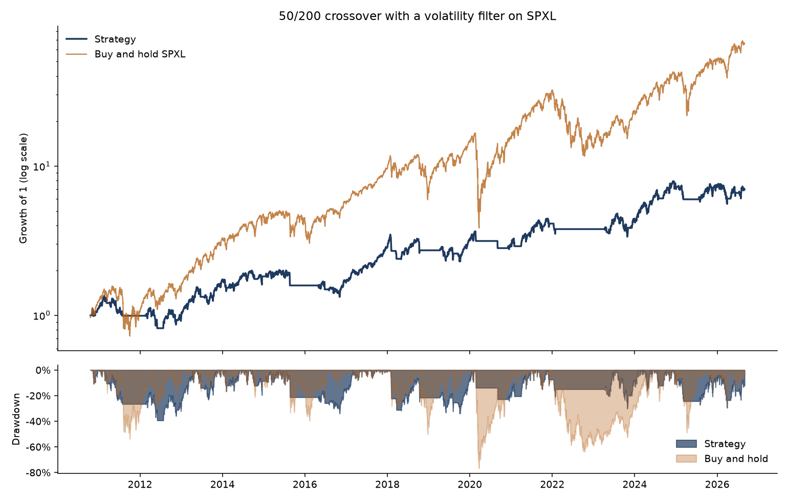

# Trend following on a leveraged ETF

A 50/200 day moving average crossover on SPXL, the 3x leveraged S&P 500 ETF,
with a realised volatility filter on top. Backtested on 16 years of daily data
with transaction costs, and tested against look-ahead bias.

**The strategy does not beat buy and hold.** It earns 13.0% a year against
30.2%, with a Sharpe of 0.59 against 0.78. What it does do is cut the maximum
drawdown from 77% to 39%. The rest of this README is about why, because the
gap between those two facts is the interesting part.

## Results

SPXL, October 2010 to August 2026, 5bp charged on every change of position:

|                  | Strategy | Buy and hold |
|------------------|---------:|-------------:|
| Total return     |   595.2% |      6457.9% |
| CAGR             |   13.03% |       30.24% |
| Volatility       |    27.2% |        50.7% |
| Sharpe           |    0.587 |        0.779 |
| Sortino          |    0.595 |        0.955 |
| Max drawdown     |   -39.4% |       -76.9% |
| Calmar           |    0.331 |        0.393 |
| Worst day        |   -12.3% |       -33.9% |

Time invested 62.2%, 48 entries over the period, 4.75% of cumulative cost drag.



## Where the strategy earns its keep, and where it loses

The filter works exactly as designed in a crash:

| Period | Strategy | Buy and hold | Time invested |
|---|---:|---:|---:|
| Feb-Apr 2020 | -0.3% (max DD -13.9%) | -45.4% (max DD -76.9%) | 24% |
| Full year 2022 | -8.1% (max DD -14.5%) | -56.6% (max DD -63.8%) | 2% |

In 2022 the strategy was in the market 2% of the year and lost 8% while the ETF
lost 57%. That is the entire case for the approach.

The problem is what happens the rest of the time. Year by year the strategy
underperforms in almost every up year, because a 200 day average on a 3x ETF
turns slowly: by the time the crossover confirms a recovery, the fastest part
of the rebound is gone. 2019 is the clearest case, +16.9% against +102.8%. Over
16 years, missing the re-entry costs more than avoiding the crashes saves.

That is a general result about trend following on leveraged instruments, not a
quirk of these parameters. Leverage makes the drawdowns you avoid bigger, but
it makes the rebounds you miss bigger by the same factor, and the rebounds come
faster than a slow moving average can follow.

## Is the result robust?

Sharpe across moving average pairs, costs included:

| short \ long | 150 | 200 | 250 |
|---|---:|---:|---:|
| 20 | 0.74 | 0.65 | 0.66 |
| 50 | 0.51 | 0.59 | 0.61 |
| 100 | 0.57 | 0.62 | 0.62 |

Every combination lands between 0.51 and 0.74, and every one is below buy and
hold at 0.78. The conclusion does not depend on the parameter pair, which is
the useful thing to know. Note that the headline 50/200 is not the best cell in
the grid, and I have left it as the headline anyway, because 20/150 being
marginally better is far more likely to be noise than signal across nine tries.

The volatility cap is a different story:

| Cap | Sharpe | Max drawdown | Time invested |
|---|---:|---:|---:|
| 30% | -0.02 | -57.8% | 30.6% |
| 40% | 0.39 | -41.3% | 52.0% |
| 45% | 0.59 | -39.4% | 62.2% |
| 60% | 0.74 | -46.2% | 73.7% |
| none | 0.58 | -76.9% | 78.9% |

Sharpe moves from -0.02 to 0.74 depending on where the cap is set. A parameter
that swings the result that much is a parameter the backtest cannot really
justify, and anyone showing you only the 45% row is showing you a fitted
number. The honest reading is that the filter reliably cuts the drawdown and
does not reliably add return.

## Avoiding the usual mistakes

**Look-ahead.** The position on day t is built from the signal on day t-1, and
there is a test for it that does not rely on reading the code: it takes a price
series, computes the positions, then multiplies the last fifty prices by three
and recomputes. If any indicator leaked information backwards, the earlier
positions would move. They do not.

**Costs.** Charged on the notional traded every time the position changes, so
twice per round trip. Setting them to zero adds about half a point of CAGR here,
which is small, but that is because the strategy trades rarely. Turnover is
reported so the assumption can be checked.

**Survivorship and data.** SPXL has existed continuously since 2008 and never
changed its mandate, so there is no survivorship problem in a single-name
backtest. Prices are adjusted closes, so dividends are reinvested on both legs
of the comparison. The backtest starts in October 2010 rather than January
because the 200 day window has to fill first.

**Windows are not warm-started.** The moving averages are NaN until the full
window is available, rather than averaging whatever is there. Otherwise the
first months would trade on a two day average called a 200 day average.

## Tests

```
python -m pytest tests/ -q
10 passed
```

They cover the look-ahead check described above, that costs reduce returns and
that no trading means no cost, that disabling the filters reproduces the asset
exactly, that a violent series is always filtered out, that the realised
volatility estimator recovers a known sigma from simulated data, and that the
drawdown and CAGR calculations are right on series where the answer is known
by hand.

## Layout

```
momentum/strategy.py    signal rules, no backtest logic
momentum/backtest.py    vectorised backtest, costs, performance statistics
momentum/data.py        price download, cached to disk
run_backtest.py         the results above, plus the sensitivity grids
quantconnect.py         the same rules as a QuantConnect algorithm
tests/                  see above
```

`momentum/strategy.py` deliberately knows nothing about backtesting and
`momentum/backtest.py` knows nothing about where the prices came from, so the
same signal code runs in the local backtest and in the QuantConnect algorithm
without being duplicated.

## Running it

```
pip install -r requirements.txt
python run_backtest.py
python -m pytest tests/ -q
```

The first run downloads prices from Yahoo Finance and caches them under
`data/`. Later runs read the cache, so the numbers above are reproducible.

## Licence

MIT.
